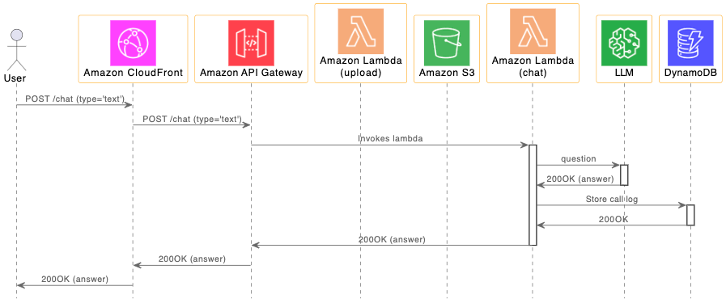
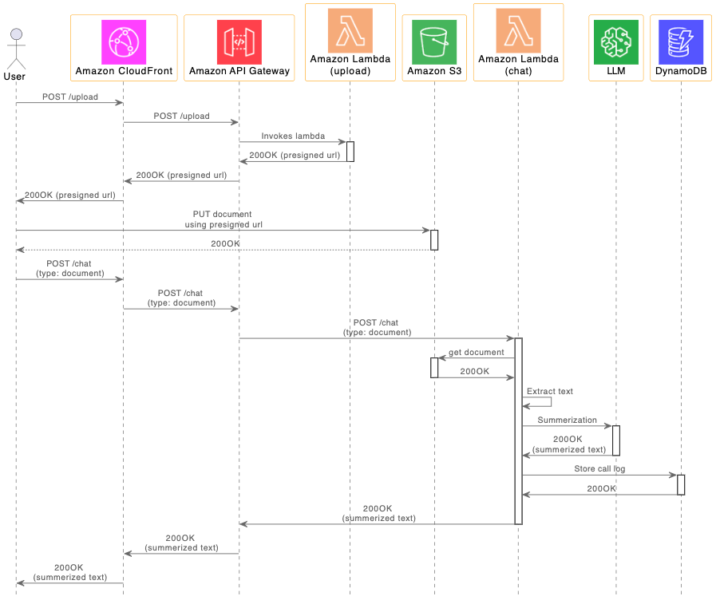

# Call Flow

채팅을 위한 call flow는 아래와 같습니다.

1) 사용자가 채팅창에서 질문(Question)을 입력합니다.
2) 이것은 Chat API를 이용하여 lambda (chat)에 전달됩니다.
3) lambda(chat)은 질문을 LLM에 전달합니다.
4) 답변을 받으면 사용자에게 결과를 전달합니다.

파일업로드 후에 문서 요약(Summerization)을 위한 call flow는 아래와 같습니다.

1) 사용자가 파일 업로드를 요청합니다. 이때 사용하는 Upload API는 lambda (upload)에 전달되어 S3 presigned url을 생성하게 됩니다.
2) 사용자가 presigned url로 문서를 업로드 하면 S3에 object로 저장됩니다.
3) Chat API에서 request type을 "document"로 지정하면 lambda (chat)는 S3에서 object를 로드하여 텍스트를 추출합니다.
4) 채팅창에 업로드한 문서의 요약(Summerization)을 보여지기 위해 summerization을 수행하고 그 결과를 사용자에게 전달합니다.

